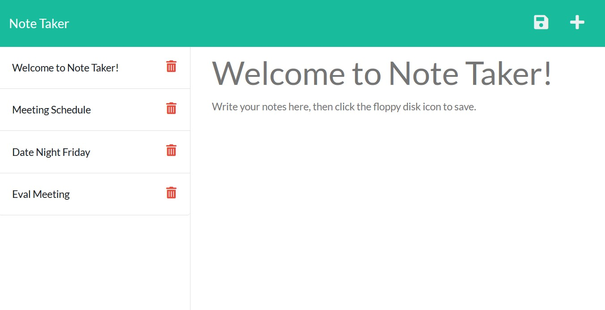

Made with Xunvyre's README generator ♡
# Note Taker with Express.js
## Description
[Welcome to Note Taker! Click here for the browser app.](https://rocky-harbor-45317.herokuapp.com/)
Designed with a busy schedule in mind, this note taking app allows you to create, save, and delete notes in your browser for convenient reminders.
## Table of Contents
* [Installation](https://github.com/xunvyre/note-taker#installation)
* [Future Development](https://github.com/xunvyre/note-taker#future-development)
* [Credits](https://github.com/xunvyre/note-taker#credits)
## Installation
You will need to use NPM and download Express.js to install this project locally.
## Usage

## Future Development
In the future I would like to add note reorganization, as well as fixing the location undefined bug for note deletion.
## Credits
Xunvyre 2022
## Contact
Please reach out to me with any questions or suggestions!
* Github: [xunvyre](https://github.com/xunvyre/)
* Email: xunvyre@gmail.com
